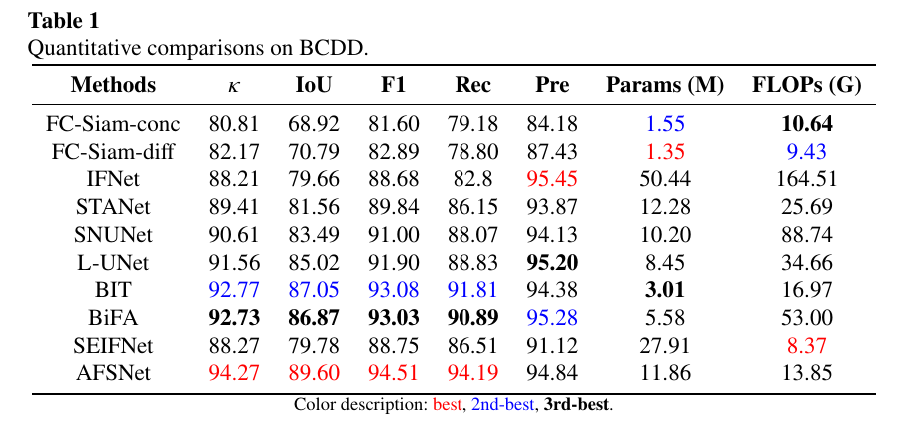
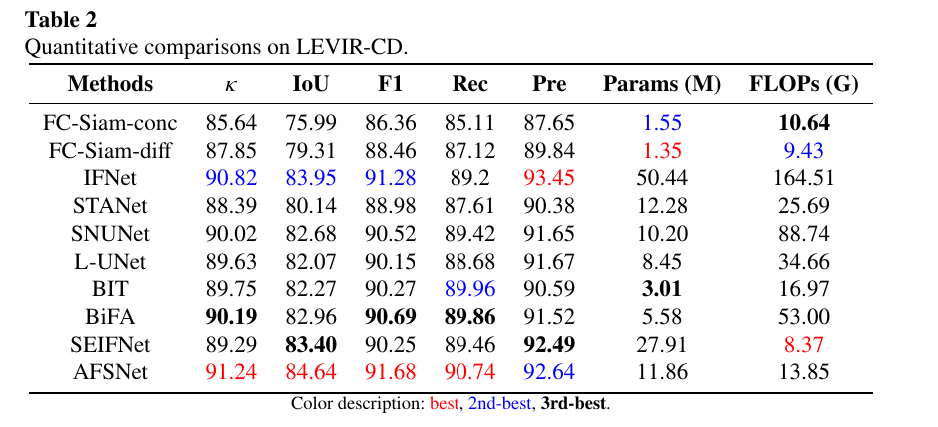

# AFSNet
About AFSNet: Remote Sensing Change Detection With Progressive Difference Feature Aggregation and Full-Scale Connection


### 1. Network

<p align="center">
     <br />
</p>

Overall structure of the AFSNet. (a) Encoder for differential dual-temporal feature extraction. (b) Decoder across full-sale connections with deep supervision. (c) Noun explanation of component terms. <br>

### 2. DataSet
+ Prepare the data:
    - Download datasets [LEVIR](https://justchenhao.github.io/LEVIR/), [BCDD](https://study.rsgis.whu.edu.cn/pages/download/building_dataset.html)
    - Then, for each dataset, you have to organise the data in the following way:

    ```
    `A`: images of t1 phase;

    `B`: images of t2 phase;

    `label`: label maps;

    `list`: contains `train.txt`, `val.txt` and `test.txt`, each file records the image names (XXX.png) in the change detection dataset.
    ```
### 3. Usage
+ pepare environments:
    - Creating a virtual environment in the terminal: `conda create -n AFSNet python=3.8`
    - Install torch==1.12.0


### 4. Change Detection Results
<p align="center">
     <br />
    <em> 
    Quantitative comparisons on BCDD
    </em>
</p>
<p align="center">
     <br />
    <em> 
    Quantitative comparisons on LEVIR-CD
    </em>
</p>


### 5. License
Code is released for non-commercial and research purposes only. For commercial purposes, please contact the authors.


